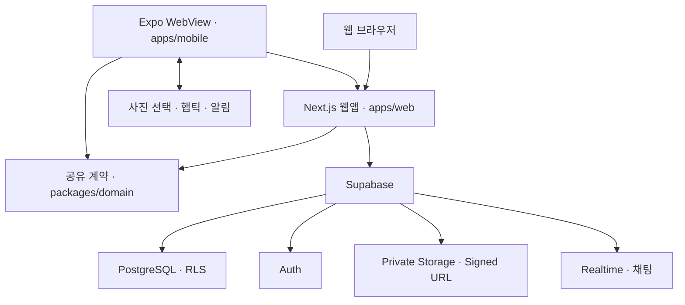

# SummerGear MVP 아키텍처

> 범위: 전환 전 MVP 구조. Go + Fiber와 자체 소셜 인증의 목표 구조는 [백엔드 전환 설계](backend-transition.md), 결정은 [ADR 003](adr/003-go-backend-and-social-auth.md)을 따릅니다. 아래 완료 표시는 기존 구현 기록이며 신규 구조의 구현·검증 완료를 뜻하지 않습니다.

**상태:** 하계 스포츠(서핑·테니스) 및 Next.js + React Native WebView Shell 아키텍처 구현 완료.

---

## 1. 시스템 컨텍스트 다이어그램

---

## 2. 컴포넌트별 책임

### Next.js 웹 애플리케이션 (`apps/web`)

- **모바일 퍼스트 UI:** 홈, 장비 마켓/상세, 판매 등록, 커뮤니티, 1:1 채팅, 프로필/인증
- **버티컬 유틸리티:** 시간대별 서핑 파도 브리핑과 테니스 코트 예약 양도
- **데이터 계층:** Supabase가 연결되면 실제 매물·커뮤니티·찜·Realtime 채팅을 사용하고, 연결 불가 시 로컬 저장 데모로 핵심 흐름을 유지
- **도메인 경계:** `@icegear/domain` Zod 스키마로 매물, 게시글, 채팅, 게시 상태, 브릿지 페이로드 검증

### Expo 모바일 웹뷰 쉘 (`apps/mobile`)

- **네이티브 래퍼:** `react-native-webview`로 웹 UI를 렌더링하고 동일 출처만 내부 탐색
- **디바이스 연동:**
  - Safe Area, 상태바, 안드로이드 뒤로가기, Pull-to-refresh, 오프라인 재시도
  - 카메라/앨범 이미지 선택 결과를 검증된 data URL로 웹 폼에 전달
  - 찜·전송·등록 햅틱, Expo 푸시 토큰 등록, 포그라운드 로컬 알림
- **URL 전환:** `EXPO_PUBLIC_WEB_URL`을 우선하고 미설정 시 플랫폼별 에뮬레이터 주소 사용

### 도메인 계약 패키지 (`packages/domain`)

- **서핑 (`surf`) 스키마:** 숏보드, 롱보드, 펀보드, 웻슈트, 핀, 리시 등 사양 검증
- **테니스 (`tennis`) 스키마:** 라켓 헤드사이즈, 무게, 그립, 플레이스타일, 신발, 가방 등 사양 검증
- **추천 규칙 엔진:** 사용자 구력, 사이즈, 종목 선호에 기반한 결정론적 맞춤 추천 알고리즘

### Supabase 백엔드 (`supabase/`)

- **데이터베이스:** PostgreSQL 스키마 및 RLS(Row Level Security) 접근 제어
- **보안 스토리지:** `listing-images` 비공개 버킷 및 10분 만료 서명된 URL(Signed URL) 제공
- **인증:** Supabase Auth (Email OTP) 기반 안전한 세션 관리
- **시드 데이터:** 결정론적 하계 스포츠 기준 데이터 및 데모 시드 (`seed.demo.sql`)

---

## 3. 핵심 데이터 및 요청 흐름

1. **마켓 조회와 이미지:**
   - 공개 `active` 매물만 RLS로 읽고 판매자 공개 projection을 별도 조회합니다.
   - private `listing-images` 객체는 Edge Function이 최대 10분 signed URL로 변환합니다.
2. **판매글 작성:**
   - `auth.uid()` 소유자로 `draft` 생성 → 사진 업로드/메타데이터 기록 → `pending_review` 전이 순서입니다.
   - 중간 실패 시 업로드 객체와 draft를 정리하며 공개 상태를 위조할 수 없습니다.
3. **커뮤니티 및 채팅:**
   - 게시글은 draft로 저장하고 댓글·1인 1좋아요는 사용자 소유 RLS를 적용합니다.
   - 메시지는 PostgreSQL Changes 구독, 읽음 RPC, 대화방 참여자 정책으로 동기화합니다.
