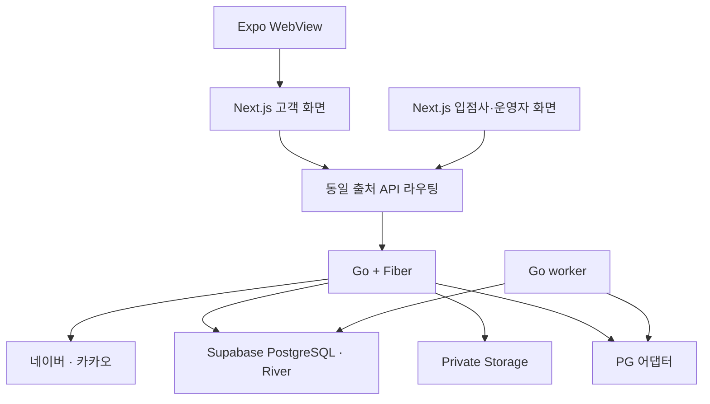

# Go 백엔드 전환 설계

상태: 구현 전 · 기준일: 2026-09-18

Go + Fiber로 API와 인증을 분리하고 입점사 거래 기능을 추가합니다. 확정된 기술 방향은 [ADR 003](adr/003-go-backend-and-social-auth.md), 구현 순서는 [로드맵](plan.md)을 따릅니다. 아래 디렉터리·API·데이터 구조는 생성 예정이며 아직 실행할 수 없습니다.

## 현재와 목표

| 영역          | 현재 코드                           | 목표                                            |
| ------------- | ----------------------------------- | ----------------------------------------------- |
| 사용자 화면   | Next.js + Expo WebView              | 유지, Go API 호출로 전환                        |
| 로그인        | Supabase 이메일 OTP                 | Go에서 네이버·카카오 로그인 처리                |
| 회원 식별     | Supabase Auth subject와 프로필 연결 | 내부 회원 ID와 외부 로그인 계정 분리            |
| 서비스 데이터 | 브라우저에서 Supabase 직접 접근     | Go의 인증·권한·검증을 통과한 접근               |
| DB            | Supabase PostgreSQL                 | Supabase PostgreSQL 유지, 인증·판매자 모델 확장 |
| 이미지        | Private Storage와 서명 URL          | Go 권한 검사 후 업로드·조회 권한 발급           |
| 채팅          | Supabase Realtime                   | Go 세션과 호환되는 인증 경로를 전환 전에 결정   |
| 거래          | 개인 매물 중심                      | 개인 판매자·입점사, 재고·주문·PG·정산           |

## 목표 구성



운영 브라우저는 웹과 같은 출처의 `/api/v1`을 사용하고 게이트웨이에서 Go로 전달하는 구성을 기본안으로 둡니다. 개발 환경도 프록시로 같은 경로를 사용합니다. 배포·서버 테스트는 `nhn-rocky`, DB는 Supabase PostgreSQL 유지, 큐는 River로 확정했습니다. 도메인·포트·배포 디렉터리는 구현 전에 확인하며 [배포·테스트 환경](deployment.md)을 따릅니다.

## 모듈과 계약

```text
apps/api/                  생성 예정: Go 모듈
  cmd/api/                 HTTP 서버
  cmd/worker/              재시도·예약 만료·정산·대조 작업
  internal/auth/           외부 로그인과 서비스 세션
  internal/members/        회원과 프로필
  internal/sellers/        입점 신청·업체·구성원
  internal/catalog/        상품·판매 상태·재고
  internal/orders/         주문·배송·구매확정
  internal/payments/       승인·취소·웹훅·PG 어댑터
  internal/settlements/    원장·정산·지급
  internal/platform/       DB·설정·로깅 등 공통 기반
packages/api-client/       생성 예정: OpenAPI 기반 TypeScript 클라이언트
supabase/migrations/       앱 스키마 변경의 단일 이력; River migration은 별도 버전 추적
```

Fiber 핸들러는 HTTP 변환을, 서비스 계층은 권한과 거래 규칙을, 저장소 계층은 SQL과 트랜잭션을 담당합니다. Fiber 컨텍스트를 장기 작업에 보관하지 않고 필요한 데이터를 작업 레코드에 복사합니다.

OpenAPI를 Go HTTP 계약의 기준으로 두고 프런트엔드 타입을 생성합니다. 기존 `packages/domain`의 화면·브릿지 스키마는 유지할 수 있지만, TypeScript Zod 검증이 Go의 서버 검증을 대신하지 않습니다. 계약의 필드·제약·오류 응답을 함께 검증합니다.

## DB 이전 범위

최종 결정은 [ADR 005](adr/005-supabase-river-toss-test.md)입니다. Supabase DB를 유지하고 기존 migration에 새 회원·거래 변경을 추가합니다. 별도 Docker 운영 DB 이전은 하지 않습니다. DB 유지와 별개로 auth FK·RLS·Storage·Realtime의 Go 인증 의존성을 해결합니다. River migration과 격리 테스트는 [배포 설계](deployment.md)를 따릅니다.

## DB 접근과 보안 경계

Go는 서버 전용 DB 계정을 사용합니다. 마이그레이션 계정과 런타임 계정을 분리하고 런타임에 superuser나 광범위한 RLS 우회 권한을 기본 부여하지 않습니다.

새 세션은 Supabase JWT가 아니므로 기존 `auth.uid()`가 자동으로 채워지지 않습니다. 이전 테이블의 RLS는 Go가 트랜잭션 안에서 설정한 신뢰된 회원 컨텍스트를 읽는 방식으로 변경하는 것을 기본안으로 둡니다. 컨텍스트는 요청 바디가 아닌 검증된 세션에서 만들고 `SET LOCAL` 수준으로 한 트랜잭션에 한정합니다. 실제 역할·정책·컨텍스트 함수는 마이그레이션 단계에서 확정하고 연결 풀 간 누출을 테스트합니다.

Go의 자원별 소유권·업체 구성원 검사를 먼저 수행하고, DB의 제약과 RLS로 추가 방어합니다. 입점사 A가 ID를 바꿔 B의 상품·주문·정산에 접근하는 것을 차단해야 합니다. worker·운영자 작업도 전용 권한과 감사 기록을 사용합니다.

## 기존 회원 이전

1. 운영 회원·거래 데이터 존재 여부와 `auth.users`, `auth.uid()`, 서비스 키, SDK 직접 접근 의존성을 조사합니다. 운영 데이터가 없다고 가정하지 않습니다.
2. 내부 회원 테이블을 추가하고 기존 프로필 ID를 가능한 한 보존합니다. 기존 Auth subject와 새 회원 ID 사이의 명시적 매핑을 만듭니다.
3. 기존 회원은 유효한 기존 로그인으로 소유권을 증명한 상태에서 새 소셜 계정을 연결합니다. 이메일이 같다는 이유만으로 자동 매핑하지 않습니다. 기존 로그인 불가 시 별도 복구 절차를 적용합니다.
4. `profiles`가 `auth.users`를 참조하는 FK와 삭제 전파를 확인한 뒤 내부 회원 참조로 전환합니다. 기존 Auth 사용자를 먼저 삭제하지 않습니다.
5. 소유권·연관 행 수·권한을 검증하고 전환 시점에 기존 세션을 종료한 뒤 다시 로그인하게 합니다.

## 기능별 전환

전환 단위마다 Go 조회·쓰기, 클라이언트 호출 변경, 기존 직접 API·RPC 쓰기 차단을 한 묶음으로 검증합니다. 프런트엔드에서 호출 코드를 없애는 것만으로 직접 접근이 차단되지는 않습니다.

인증 기능을 개발하는 동안 기존 서비스를 유지할 수 있지만, 새 인증의 운영 전환은 인증 의존 기능 전체가 준비된 뒤 수행합니다. 상품만 옮기고 기존 Supabase 세션이 필요한 채팅·이미지를 새 사용자에게 그대로 노출하지 않습니다.

| 잔여 의존성                  | 인증 전환 전 필요한 조치                                                                    |
| ---------------------------- | ------------------------------------------------------------------------------------------- |
| 프로필·찜·커뮤니티·푸시 토큰 | Go API 및 회원 매핑, 기존 직접 쓰기 권한 차단                                               |
| Storage                      | Go가 소유권 확인 후 제한된 서명 권한 발급, 기존 이미지 경로 호환성 검증                     |
| 이미지·추천 Edge Functions   | 사용자 JWT 의존 제거 또는 Go 모듈로 이전                                                    |
| 채팅·Realtime                | Go 인증 WebSocket/SSE 또는 검증된 인증 연계 방식 선택·구현; 결정 전에는 인증 운영 전환 불가 |
| Next.js SSR·콜백·프록시      | Supabase 세션 갱신 의존 제거, Go 세션 전달 검증                                             |
| Expo WebView                 | 외부 로그인 후 안전한 앱 복귀와 세션 전달 검증                                              |

## 전환과 복구

스키마는 추가 → 데이터 이관 → 호출 전환 → 이전 접근 차단 → 구 구조 정리 순서로 진행합니다. 구 코드와 신규 데이터가 호환되는 기간을 확보하고 운영 복구 연습 전에는 파괴적인 컬럼·테이블 삭제를 하지 않습니다.

운영 전환 시 짧은 쓰기 제한 구간에서 최종 이관과 대조를 수행합니다. 한 기능의 쓰기 소유자는 항상 하나로 유지합니다. 복구가 필요하면 쓰기를 중지하고 신규 기록을 보존·대조한 뒤 호환성을 확인한 버전으로 복귀합니다. 단순 플래그 변경으로 구 인증에 새 사용자가 로그인할 수 있다고 가정하지 않습니다.

결제 승인·환불·지급 등 외부 부작용은 DB 복원으로 취소되지 않습니다. PG 기록을 기준으로 미반영 결과를 복구하고 재실행에는 같은 멱등 키를 사용합니다.

## 구현 전 확정 항목

- 운영 사용자와 데이터 유무, 계정 연결·복구 운영 담당
- 원격 저장소·배포 디렉터리, 도메인·프록시와 DB 백업 구성
- 세션 유효기간, 동시 접속 정책, 운영자 추가 인증
- 채팅의 Go 세션 연계 방식
- 토스페이먼츠 테스트 키·콜백 설정; 실결제·지급대행 계약은 후속 범위

Go·Fiber 패치 버전, SQL 접근 라이브러리와 작업 실행 방식은 API 기반 단계에서 고정합니다. 작업 큐는 [River](background-jobs.md)로 확정했으며 버전·연결·권한을 검증합니다. 현재 실행 방법은 [개발 가이드](development.md)를 사용합니다.
