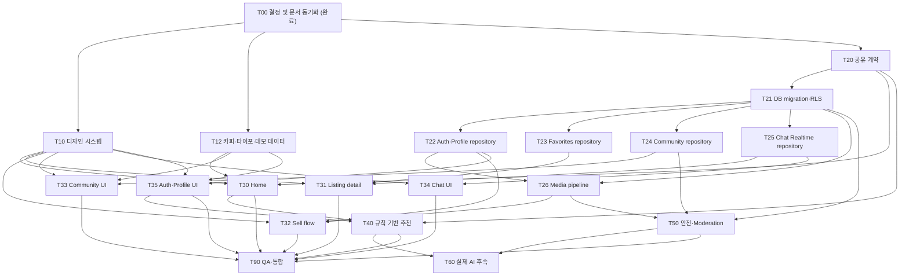

# IceGear 모바일 MVP 고도화 작업 계획

- **상태:** `T00` 결정 게이트 및 문서 동기화 완료; schema/UI 구현 미착수
- **기준일:** 2026-08-14
- **주요 범위:** Expo 모바일 앱, 공유 도메인 계약, Supabase Auth/Postgres/RLS/Storage/Realtime
- **비교 기준:** [FitLoop - Reimagining Circular Fashion](https://www.behance.net/gallery/251515731/FitLoop-Reimagining-Circular-Fashion)
- **상위 기준:** 제품 범위와 보안 원칙은 [`SSOT.md`](SSOT.md)가 우선한다. 이 계획을 구현하면서 범위가 확정되면 SSOT와 관련 ADR을 같은 변경에서 갱신한다.

이 문서는 현재 코드베이스와 지금까지 합의한 방향을 실제 작업 단위로 연결한다. FitLoop의 로고, 이미지,
아이콘, 문구, 화면을 복제하지 않고 큰 타이포그래피, 넓은 여백, 추천 근거 노출, 간결한 거래 흐름 같은
설계 원칙만 IceGear의 스키·아이스하키 문맥으로 재해석한다.

## 목표

1. 현재 Expo Router 기반을 유지하면서 모바일 앱 전체를 하나의 일관된 IceGear 디자인 시스템으로 정리한다.
2. 홈, 상품 상세, 판매 등록, 커뮤니티, 채팅, 프로필의 핵심 흐름을 데모 화면이 아닌 연결된 MVP로 완성한다.
3. 겨울 스포츠에 맞는 장비 속성, 사이즈·실력 기반 추천 이유, 거래 상태를 사용자가 쉽게 이해하도록 만든다.
4. favorites, comments/reactions, profile/onboarding, Realtime chat, 이미지 업로드를 Supabase RLS 경계에 연결한다.
5. 향후 이미지 분석·가격 제안·개인화 추천을 Edge Function 또는 별도 worker로 추가할 수 있도록 계약을 분리한다.
6. Expo Web과 iOS/Android에서 같은 기능 의미를 유지하며 접근성, 안전 영역, 키보드, 폰트, 성능 회귀를 막는다.

### 이번 MVP에서 하지 않는 것

- 결제, 정산, 배송 자동화, 환불, 분쟁 처리
- AR 가상 착용
- 행동 데이터가 충분하지 않은 상태에서의 ML ranking 또는 embedding 추천
- 클라이언트에 AI provider key 또는 Supabase service-role key 노출
- FitLoop의 브랜드 자산이나 화면을 픽셀 단위로 복제
- 모바일 디자인 고도화와 무관한 Next.js 웹 전면 개편

### 추천 표기 원칙

- 명시적인 사용자 입력과 규칙으로 계산한 결과는 **맞춤 추천** 또는 **추천 이유**로 표시한다.
- 실제 모델 호출이 없는 mock이나 규칙 기반 결과에 **AI 추천/AI 분석 완료**라는 문구를 사용하지 않는다.
- 실제 AI 기능은 구조화된 응답 검증, 비용 제한, rate limit, 실패 fallback, 개인정보 보존 정책이 준비된 뒤 활성화한다.

## 현재까지 완료된 작업

### 저장소와 아키텍처

- pnpm workspace에 Expo 모바일, Next.js 웹, `packages/domain`, Supabase migration/seed가 구성되어 있다.
- Expo Router 모바일 앱에 홈·커뮤니티·판매·채팅·나의 IceGear의 5개 하단 탭이 있다.
- 웹과 모바일이 공유하는 ski/hockey listing 및 profile 입력 계약과 Zod 검증 테스트가 있다.
- 공개 키만 사용하는 모바일 Supabase client와 플랫폼별 Auth session storage adapter가 있다.

### 모바일 화면과 상호작용

- 홈에서 active listing 조회, 텍스트 검색, 스키/하키 필터, 이미지 fallback, 상세 이동이 동작한다.
- 상품 상세, 판매 작성, 인증 진입, 커뮤니티 피드·상세·작성, 채팅 목록·대화, 프로필 화면의 vertical slice가 있다.
- 판매 작성은 인증 사용자의 listing을 `draft`로 저장하고 공유 도메인 schema로 입력을 검증한다.
- 커뮤니티와 채팅은 Supabase 연결/인증 상태에 따라 실제 조회 또는 안전한 demo fallback을 제공한다.
- 상품 카드의 외부/내부 `Pressable`을 형제 구조로 분리해 Expo Web의 중첩 `<button>` 오류를 해소했다.

### 디자인과 콘텐츠

- Pretendard를 본문/UI, Paperlogy를 display, Barlow Condensed를 영문 eyebrow·가격·통계에 사용하는 혼합 타이포그래피가 적용되어 있다.
- 폰트 로딩, Android 굵기 매핑, splash 종료 처리와 폰트 라이선스 문서가 있다.
- 현재 테마는 밝은 canvas와 white surface, coral action, navy panel을 중심으로 구성되어 있다.
- `seed.demo.sql`에 익명 판매자 3명, active 상품 14개, 커뮤니티 글 4개의 반복 실행 가능한 데모 데이터가 있다.

### Supabase 기반

- `0001_init.sql`에 profile, sports, listings/images, favorites, conversations/messages,
  community posts/comments, reports, blocks, reviews 테이블과 상태 trigger, index, RLS가 있다.
- active listing/community의 공개 read와 owner/participant/moderator 경계가 정의되어 있다.
- 메시지에는 `read_at`, 상품에는 sport별 `details` JSONB가 이미 존재한다.
- 기존 문서에 기록된 기준 검증은 `typecheck`, `test`, `lint`, `build`, `format:check`, Expo Web export까지 통과했다.

### 아직 데모 또는 placeholder인 부분

- 홈의 찜은 화면 로컬 상태이며 `favorites` 테이블에 저장되지 않는다.
- 커뮤니티 댓글과 좋아요는 화면 로컬 상태이고, DB에는 reaction 테이블이 없다.
- 채팅은 Realtime 구독과 실제 unread count 갱신이 없으며 미인증 시 demo 대화를 표시한다.
- 프로필 통계와 활동 메뉴는 placeholder이고 onboarding 및 선호 sport/skill 저장 흐름이 없다.
- 판매 등록은 이미지 선택·압축·Storage upload와 sport별 상세 필드가 연결되지 않았다.
- 커뮤니티 작성이 클라이언트에서 바로 `active`를 요청하므로 moderation 원칙과 정합화가 필요하다.
- listing repository는 현재 `getPublicUrl`을 사용하며, 확정된 private Storage/signed URL 정책으로 교체되지 않았다.

## 구현 전 결정 게이트 — 완료

아래 항목은 2026-08-14 `T00`에서 모두 확정했으며 [ADR 002](adr/002-mobile-mvp-safety-boundaries.md),
SSOT, 데이터 모델, API 계약, 아키텍처에 반영했다. 후속 구현은 이 표보다 권한이나 공개 범위를 넓힐 수 없다.

| 게이트 | 확정 결정 | 상태 | 영향을 받는 작업 |
| --- | --- | --- | --- |
| 인증 provider | Production은 email OTP. anonymous Auth는 별도 non-production project에서 `EXPO_PUBLIC_ENABLE_DEMO_AUTH=true`일 때만 허용하며 production에서는 provider와 flag를 모두 비활성화 | 확정 | `T22`, `T35` |
| profile 추천 입력 | `profile_sports(profile_id, sport_id, skill_level)`이 canonical 관계. `(profile_id, sport_id)` PK, skill/size/preferences는 선택적 sport별 값 | 확정 | `T20`, `T21`, `T40` |
| reaction 규칙 | MVP는 `(post_id, user_id)`당 `like` 1개. 다중 reaction은 후속 migration | 확정 | `T21`, `T24`, `T33` |
| listing 공개 정책 | seller는 `draft` 생성과 `pending_review` 요청만 가능. 기존 `moderator`/`admin` operator만 감사 경계에서 `active` 공개 | 확정 | `T21`, `T32`, `T50` |
| 커뮤니티 공개 정책 | 일반 사용자는 `draft` post만 작성하고 `moderator`/`admin`만 감사 경계에서 `active` 공개 | 확정 | `T21`, `T24`, `T50` |
| 상품 이미지 공개 방식 | private `listing-images` bucket + 최대 10분 signed URL. public bucket, raw path, `getPublicUrl` fallback 금지 | 확정 | `T26`, `T32`, `T50` |
| 추천 명칭 | 규칙 기반은 `맞춤 추천`/`추천 이유`이며 AI로 표기하지 않음 | 확정 | `T30`, `T40`, `T60` |
| 영향 지표 | audit 가능한 완료 거래/재사용 건수만 표시. 기준 데이터가 없으면 숨기고 근거 없는 CO2/CO₂ 환산 금지 | 확정 | `T35`, `T40` |

Gate 해제는 구현 완료를 뜻하지 않는다. 현재 `0001_init.sql`의 owner active insert/update와 모바일 repository의
`getPublicUrl`은 확정 정책과 다른 알려진 차이이며 `T21`/`T24`/`T26`에서 닫아야 한다. Production Supabase의
email delivery/redirect/rate limit, anonymous provider off, moderator/admin 계정은 저장소 밖 운영 선행 조건이다.

## 남은 작업

| 작업 ID | 목표와 주요 산출물 | 선행 작업 | 병렬 실행 |
| --- | --- | --- | --- |
| `T00` | **완료(2026-08-14):** 결정 게이트 확정, SSOT·ADR·API/데이터/아키텍처 문서 동기화, MVP/후속 범위 고정 | 없음 | 완료; `T10`/`T12`/`T20` 시작 가능 |
| `T10` | IceGear semantic color/spacing/radius/elevation/type/icon token과 공통 UI primitive 구축 | `T00` | `T20`, `T12`와 병렬 |
| `T12` | 실제 한국어 문구, typography 사용표, 추천 사유 문구, 현실적인 demo listing/community 데이터 작성 | `T00` | `T10`, `T20`과 병렬 |
| `T20` | profile preference, recommendation reason, community reaction, media 상태에 필요한 공유 타입·Zod 계약 확정 | `T00` | `T10`, `T12`와 병렬 |
| `T21` | 새 migration으로 `profile_sports`, one-like, index/constraint/RLS 추가 및 seller/author의 active 우회 제거 | `T20` | migration 단일 소유자 |
| `T22` | email OTP, production anonymous 차단, demo flag, session 상태, profile/onboarding repository 구현 | `T21` | `T23`~`T26`과 병렬 |
| `T23` | favorites repository, optimistic update/rollback, 로그인 유도 경계 구현 | `T21` | `T22`, `T24`~`T26`과 병렬 |
| `T24` | community comments, one-like/count, draft 생성과 moderator/admin publication repository 구현 | `T21` | `T22`, `T23`, `T25`, `T26`과 병렬 |
| `T25` | conversation 생성, Realtime message 구독, `read_at`, unread 집계, 재연결/중복 제거 구현 | `T21` | `T22`~`T24`, `T26`과 병렬 |
| `T26` | 이미지 선택·압축·private Storage upload·정렬·삭제·최대 10분 signed URL 경계와 public URL fallback 제거 | `T21`, `T22` | `T23`~`T25`와 병렬 |
| `T30` | FitLoop에서 착안한 editorial 홈, 2열 상품 카드, 가로 추천 rail, 추천 이유, 검색/필터 상태 구현 | `T10`, `T12`, `T20` | `T31`~`T35`와 병렬 |
| `T31` | 이미지 중심 상품 상세, seller/상태/장비 속성, persisted favorite, 채팅 시작 CTA 구현 | `T10`, `T20`, `T23`, `T25` | `T32`~`T35`와 병렬 |
| `T32` | 단계형 판매 등록, 스키/하키별 필드, 이미지 순서, 검토 화면, draft 제출 구현 | `T10`, `T20`, `T22`, `T26` | `T31`, `T33`~`T35`와 병렬 |
| `T33` | 커뮤니티 피드·상세·작성 화면 재설계와 실제 comments/reactions/moderation 상태 연결 | `T10`, `T12`, `T24` | `T31`, `T32`, `T34`, `T35`와 병렬 |
| `T34` | 채팅 목록·대화 화면 재설계, 실시간 수신, 읽음/전송/오류/재시도 상태 연결 | `T10`, `T25` | `T31`~`T33`, `T35`와 병렬 |
| `T35` | 로그인·onboarding·프로필·활동 및 audit 가능한 거래/재사용 통계 화면과 실제 session/profile 상태 연결 | `T10`, `T12`, `T22` | `T31`~`T34`와 병렬 |
| `T40` | 명시적 선호 sport·skill·사이즈와 listing details를 사용하는 결정론적 추천 및 설명 생성 | `T20`, `T22`, `T30`, `T35` | 화면 작업 뒤 단독 통합 권장 |
| `T50` | 신고·차단 진입점, media/content moderation 상태, 운영자 publication 경계와 감사 가능성 보완 | `T21`, `T22`, `T24`, `T26` | `T40`과 일부 병렬 |
| `T60` | 실제 이미지 분석·가격 제안·개인화 추천 Edge Function 계약과 provider adapter 구현 | `T26`, `T40`, `T50` | **후속 단계**, MVP 완료를 막지 않음 |
| `T90` | 단위·컴포넌트·RLS·통합·실기기 QA, 성능/접근성 점검, 전체 문서 동기화 | 실행 대상 모든 작업 | 최종 통합 |

### 작업 분담 원칙

- **Antigravity:** `T12`의 한국어 카피, typography 사용안, 추천 사유 문구, demo 상품/커뮤니티 데이터 초안을 담당한다.
- **Codex CLI:** `T00`, 설계, 코드 구현, 공유 계약, migration/RLS, 테스트, 문서 통합을 담당한다.
- 각 작업은 별도 Git worktree/branch에서 수행하고, migration과 공통 토큰은 각각 한 명만 소유한다.
- 현재 작업 트리에 미커밋 변경이 있으므로 새 worktree를 만들기 전에 현 상태를 보존하는 checkpoint commit 또는 동등한 기준 commit을 먼저 만든다. 사용자 변경을 임의로 버리거나 reset하지 않는다.
- `theme.ts`, root/mobile `package.json`, `pnpm-lock.yaml`, SSOT는 integration 담당자가 마지막에 병합한다.
- Antigravity 산출물은 독립 worktree에서 전달받고 Codex가 schema·라이선스·보안·빌드 정합성을 검토한 뒤 통합한다.

## 파일별 변경 계획

### 모바일 공통 기반

| 파일 | 변경 계획 |
| --- | --- |
| `apps/mobile/package.json` | Expo SDK와 호환되는 vector icon, image picker/manipulation, test 도구를 필요한 시점에만 추가하고 `test` script를 등록한다. |
| `pnpm-lock.yaml` | dependency 변경을 한 번의 integration 단계에서 갱신한다. 작업 agent가 각자 수정하지 않는다. |
| `apps/mobile/app.json` | image library 권한 설명, deep-link scheme, 필요한 플랫폼 plugin만 추가한다. |
| `apps/mobile/lib/theme.ts` | 기존 raw 색상을 semantic token(`background`, `surface`, `text`, `accent`, `success`, `warning` 등)으로 바꾸고 spacing/radius/elevation/touch target을 함께 정의한다. 기존 formatter/label은 별도 모듈로 분리한다. |
| `apps/mobile/lib/typography.tsx` | 현재 3개 font family와 실제 굵기 매핑을 유지하고 display/title/body/caption/price의 semantic style을 제공한다. 폰트 파일 교체는 하지 않는다. |
| `apps/mobile/lib/format.ts` | `formatPrice`, 위치, 시간, 스포츠/카테고리/상태 label을 `theme.ts`에서 분리한다. |
| `apps/mobile/components/ui/*` | `AppIcon`, `Button`, `IconButton`, `Chip`, `Surface`, `ScreenHeader`, `StateView`, `Avatar`, `Divider`를 추가하고 접근성 label과 44px 이상 터치 영역을 기본값으로 둔다. |
| `apps/mobile/components/listings/*` | `ListingCard`, `ListingImage`, `RecommendationRail`, `RecommendationReason`, `ListingAttributeGrid`를 화면에서 추출한다. 카드 전체 이동과 찜 버튼은 중첩 interactive element가 되지 않도록 형제 구조를 유지한다. |
| `apps/mobile/components/community/*` | 재사용 가능한 `PostCard`, reaction/count, moderation badge를 추가한다. |
| `apps/mobile/components/chat/*` | conversation row, message bubble, composer, connection state를 추가한다. |
| `apps/mobile/app/_layout.tsx` | font/splash 초기화는 유지하고 Auth/session 및 향후 query 상태 provider의 위치, status bar와 전역 오류 경계를 정리한다. |
| `apps/mobile/app/(tabs)/_layout.tsx` | 문자/emoji icon을 vector line icon으로 교체하고 active/inactive 색, 가운데 판매 action, iOS/Android safe-area를 통일한다. |

### 모바일 화면

| 파일 | 변경 계획 |
| --- | --- |
| `apps/mobile/app/(tabs)/index.tsx` | 데이터 조합과 화면 layout만 담당하도록 축소한다. editorial header, 검색, sport filter, 추천 rail, 최근/근처 상품 2열 grid, loading/error/empty 상태를 구성한다. |
| `apps/mobile/app/listing/[id].tsx` | full-width gallery, 거래 상태, sport별 속성, 추천 이유, seller summary, sticky favorite/chat CTA로 개편한다. 접근 불가와 존재하지 않음을 같은 안전한 상태로 처리한다. |
| `apps/mobile/app/create.tsx` | 단계형 form을 구성하고 사진 → AI 없는 기본 정보 입력 → sport별 속성 → 가격/거래 방식 → 검토 → draft 저장 순서로 개편한다. 분석 기능이 없을 때 수동 입력 경로가 항상 동작해야 하며, draft 저장 후 active 피드로 이동시키지 않고 검토 상태/다음 행동을 보여준다. |
| `apps/mobile/app/(tabs)/sell.tsx` | `create.tsx`의 실제 화면을 재사용하되 tab 진입과 독립 route 진입에서 뒤로가기/완료 이동이 다르지 않도록 route contract를 정리한다. |
| `apps/mobile/app/(tabs)/community.tsx` | 정보형/editorial post card, sport/type filter, 작성 CTA, moderation 상태를 반영한다. |
| `apps/mobile/app/community/[id].tsx` | persisted comment/reaction, optimistic rollback, 신고 진입점, 키보드 회피를 적용한다. |
| `apps/mobile/app/community/create.tsx` | 인증/validation/draft 결과를 명확히 표시하고 “게시 완료”와 “검토 요청” 문구를 publication 정책에 맞춘다. |
| `apps/mobile/app/(tabs)/chats.tsx` | 실제 unread count와 Realtime 상태를 표시하며 미인증 사용자는 demo 목록 대신 로그인 안내 상태를 기본으로 한다. 시연 mode는 명시적으로 분리한다. |
| `apps/mobile/app/chat/[id].tsx` | optimistic send, 서버 확정, 중복 제거, 재전송, 읽음 처리, 키보드/하단 safe-area를 구현한다. |
| `apps/mobile/app/auth.tsx` | 결정된 provider, callback/deep link, 로딩/취소/실패/로그아웃 상태와 개발용 anonymous Auth 경계를 구현한다. |
| `apps/mobile/app/(tabs)/profile.tsx` | profile/onboarding, 선호 sport/skill, 찜/판매/게시글, 검증 가능한 재사용 통계를 실제 repository에 연결한다. |

### 모바일 데이터 계층

| 파일 | 변경 계획 |
| --- | --- |
| `apps/mobile/lib/listings/repository.ts` | pagination/filter 계약, 공개 가능한 최소 seller projection/view, signed media URL, sport details mapping, 일관된 오류 코드를 추가한다. public bucket을 가정하는 `getPublicUrl`은 결정된 media 정책에 맞게 제거/대체한다. |
| `apps/mobile/lib/favorites/repository.ts` | favorite 목록/추가/삭제와 idempotent 결과를 구현한다. owner session을 payload로 받지 않고 Supabase session에서 확인한다. |
| `apps/mobile/lib/community/repository.ts` | demo 상수와 production repository를 분리하고 author projection, comment/reaction count, draft 생성, pagination, 오류를 구현한다. |
| `apps/mobile/lib/chat/repository.ts` | demo transport를 분리하고 conversation 생성, message page, Realtime subscribe/unsubscribe, read update, unread count를 구현한다. 현재 conversation마다 message를 다시 읽는 N+1 목록 조회는 view/RPC 또는 집계 query로 제거한다. |
| `apps/mobile/lib/profile/repository.ts` | 현재 사용자 profile, onboarding upsert, preference와 활동 통계를 구현한다. |
| `apps/mobile/lib/media/listing-images.ts` | 파일 검증, resize/compress, private path 생성, upload/rollback/delete, signed URL 요청을 캡슐화한다. |
| `apps/mobile/lib/recommendations/rules.ts` | side effect 없는 결정론적 점수와 한국어 추천 이유 코드를 구현한다. 입력이 없을 때 최신/인기 fallback을 사용한다. |
| `apps/mobile/lib/recommendations/repository.ts` | 규칙 기반과 미래 remote AI provider가 같은 결과 타입을 반환하도록 adapter 경계를 둔다. |
| `apps/mobile/lib/supabase/client.ts` | public 설정과 session persistence 원칙을 유지하고, service-role/AI secret을 절대 추가하지 않는다. |

### 공유 계약, Supabase, 웹 호환성

| 파일 | 변경 계획 |
| --- | --- |
| `packages/domain/src/listings.ts` | UI가 문자열 key를 추측하지 않도록 ski/hockey 필수·선택 상세 속성과 추천 입력에 필요한 공개 필드를 명확히 한다. |
| `packages/domain/src/profiles.ts` | 선호 sport, sport별 skill, 선택적 사이즈 preference와 onboarding payload를 canonical 이름으로 정리한다. |
| `packages/domain/src/actors.ts` | community reaction/comment count와 recommendation result/reason 계약을 정리한다. |
| `packages/domain/src/schemas.ts`, `index.ts` | 새 validator/type을 public export한다. |
| `packages/domain/tests/validation.test.ts` | sport별 listing, profile preference, reaction, recommendation 결과의 정상/오류 경계를 추가한다. |
| `supabase/migrations/0002_profile_reactions.sql` | 배포된 `0001_init.sql`을 수정하지 않고 profile preference/onboarding, 공개 가능한 최소 seller projection, community reaction, publication 보정, index, trigger, RLS를 순서 있는 migration으로 추가한다. |
| `supabase/migrations/0003_storage_realtime.sql` | private listing image bucket/object policy와 필요한 Realtime publication/read 관련 변경을 별도 migration으로 추가한다. |
| `supabase/tests/*.sql` | anonymous, owner, 다른 사용자, participant, moderator/admin별 CRUD/RLS와 draft→active 전이를 검증한다. |
| `supabase/seed.demo.sql` | Antigravity가 작성한 한국어 상품/게시글/추천 입력 데이터를 idempotent SQL로 반영한다. 실제 Auth 계정, 개인 정보, 운영 환경 전용 ID는 넣지 않는다. |
| `supabase/functions/recommend-listings/index.ts` | `T60`에서만 추가한다. 인증된 subject, 검증된 payload, timeout/rate limit, 구조화된 결과와 fallback을 구현한다. |
| `supabase/functions/analyze-listing/index.ts` | `T60`에서만 추가한다. 이미지 접근 범위, MIME/크기, provider secret, 결과 schema, 삭제/보존 정책을 강제한다. |
| `apps/web/lib/supabase/database.types.ts` | migration 적용 후 Supabase CLI로 재생성한다. 수동 편집하지 않는다. |
| `apps/web/lib/listings/repository.ts` 및 테스트 | 공유 listing 계약 변경으로 기존 웹 browse/detail mapping이 깨지지 않도록 최소 호환 수정과 회귀 테스트만 수행한다. 웹 디자인 개편은 하지 않는다. |

### 문서와 테스트 기반

| 파일 | 변경 계획 |
| --- | --- |
| `docs/SSOT.md` | 승인된 MVP 범위, 맞춤 추천 명칭, Auth/media/publication/지표 결정을 확정 상태로 유지한다. |
| `docs/mobile-mvp.md` | 새 정보 구조, 화면 상태, typography/icon/추천 원칙, demo와 production 경계를 기록한다. |
| `docs/architecture.md` | direct Supabase, signed media 경계, Realtime, Edge Function의 책임을 갱신한다. |
| `docs/data-model.md` | 확정 target과 현재 migration 차이를 구분하고 `profile_sports`, one-like, `listing_images`, publication RLS를 기록한다. |
| `docs/api-contracts.md` | email OTP/demo, draft/publication, one-like, signed image, 맞춤 추천, 감사 가능한 지표 요청·응답과 오류를 기록한다. |
| `docs/development.md` | 로컬 Storage/Realtime/Edge Function 설정, seed, 검증 명령과 문제 해결 방법을 추가한다. |
| `apps/mobile/jest.config.*`, `jest.setup.*` | Expo SDK 호환 test runner와 React Native mock을 구성한다. 정확한 확장자와 버전은 구현 시 Expo 공식 호환 조합으로 확정한다. |
| `apps/mobile/**/*.test.ts(x)` | repository/추천 규칙/component interaction과 상태별 화면 테스트를 추가한다. |

## 구현 순서와 의존성



### 실행 Wave

1. **Wave 0 — 결정(완료):** `T00`. 데이터/표기/보안 결정과 문서 정합성을 2026-08-14에 고정했다.
2. **Wave 1 — 기반 병렬화:** `T10`, `T12`, `T20`을 서로 다른 worktree에서 진행한다.
3. **Wave 2 — 데이터 연결:** `T21`을 먼저 통합한 뒤 `T22`~`T26`을 파일 소유권이 겹치지 않게 병렬 진행한다.
4. **Wave 3 — 화면 병렬화:** 공통 UI가 통합되면 `T30`~`T35`를 화면별 worktree에서 진행한다. 각 화면은 먼저 repository interface/mock으로 작업하고 해당 데이터 작업을 merge한 뒤 실제 연결한다.
5. **Wave 4 — 제품 지능/안전:** `T40`과 가능한 `T50` 작업을 진행한다. 규칙 기반 추천을 먼저 검증한다.
6. **Wave 5 — 통합/QA:** `T90`. shared file, lockfile, migration, generated type, 문서를 integration worktree에서 정리한다.
7. **후속 Wave — 실제 AI:** MVP 기준을 통과한 뒤 별도 승인으로 `T60`을 진행한다.

### 통합 순서

1. 문서/결정 (`T00`)
2. 공유 도메인 계약 (`T20`)
3. 디자인 토큰과 UI primitive (`T10`), 카피/데이터 산출물 (`T12`)
4. migration/RLS와 DB test (`T21`)
5. Auth/Profile → Media → Favorites/Community/Chat repository (`T22`, `T26`, `T23`~`T25`)
6. App shell과 개별 화면 (`T30`~`T35`)
7. 규칙 기반 추천과 moderation (`T40`, `T50`)
8. generated DB type, web 호환 수정, lockfile
9. 전체 QA와 문서 (`T90`)
10. 실제 AI 기능 (`T60`, 후속 승인 시)

## 주의할 회귀 위험

| 위험 | 방지 방법 |
| --- | --- |
| Expo Web에서 `<button>` 안에 `<button>`이 다시 생성됨 | 카드 이동 영역과 favorite/menu 버튼을 형제 `Pressable`로 유지하고 브라우저 console을 테스트한다. |
| 2열 grid와 가로 추천 목록이 `FlatList` nesting 경고·스크롤 끊김을 만듦 | 동일 방향 virtualized list 중첩을 피하고 하나의 `FlatList`/`SectionList` header 구조 또는 고정 크기 row를 사용한다. |
| semantic token 변경으로 기존 화면 대비·상태 색이 깨짐 | raw color 직접 사용을 금지하고 light theme 기준 contrast와 disabled/error/selected 상태를 component 단위로 검증한다. |
| Paperlogy/Pretendard 줄바꿈이 Web, Android, iOS에서 달라짐 | 고정 높이 headline을 피하고 최대 글자 크기, line height, font scaling, 긴 한국어 문구를 실기기에서 검증한다. |
| 하단 tab/sticky CTA/composer가 safe-area 또는 키보드에 가려짐 | `react-native-safe-area-context`와 keyboard avoidance를 화면별로 검증하고 임의 bottom padding 중복을 제거한다. |
| local favorite/reaction optimistic 상태가 서버 실패 후 잘못 남음 | mutation key를 idempotent하게 만들고 서버 실패 시 rollback·오류 안내·재조회 규칙을 둔다. |
| Realtime 재연결 시 메시지가 중복되거나 순서가 바뀜 | message ID 기반 dedupe, server timestamp 정렬, subscription cleanup, reconnect 후 catch-up query를 구현한다. |
| unread/read update가 상대 메시지까지 임의 수정함 | DB policy와 repository가 participant 및 sender/recipient 조건을 함께 검증하고 RLS 테스트를 추가한다. |
| 커뮤니티 일반 사용자가 직접 `active` 콘텐츠를 만들거나 숨겨진 글이 노출됨 | insert status를 draft로 제한하고 publication은 moderator/admin server 경계와 RLS 양쪽에서 강제한다. |
| private Storage 정책인데 `getPublicUrl`로 draft 이미지가 노출됨 | private bucket과 최대 10분 signed projection을 사용하고 public URL/raw path fallback을 제거한다. |
| 이미지 upload 성공 후 listing/image row 실패로 고아 object가 남음 | 보상 삭제, deterministic path, 재시도/idempotency, 정리 job 또는 운영 절차를 둔다. |
| profile/shared type 변경이 Next.js 웹 mapping을 깨뜨림 | domain과 DB type을 먼저 통합하고 root `typecheck/test/build` 및 웹 repository test를 실행한다. |
| demo fallback이 운영 장애를 정상 데이터처럼 숨김 | demo mode를 명시적 개발 flag로 분리하고 production에서는 setup/error/login 상태를 표시한다. |
| 추천 결과가 근거 없이 편향되거나 AI로 오인됨 | 입력·점수·추천 사유를 결정론적으로 테스트하고 실제 모델 연결 전 AI 표현을 금지한다. |
| placeholder·seed·`sold` 상태를 재사용 성과로 집계하거나 CO2 환산치를 노출함 | 완료 record ID/timestamp로 재계산 가능한 거래·재사용 건수만 표시하고 기준 데이터가 없으면 지표를 숨긴다. |
| AI/이미지 분석 비용·비밀·개인정보가 클라이언트로 유출됨 | Edge Function에 secret을 두고 auth, rate limit, payload size/MIME, timeout, 구조화된 응답, 보존 정책을 강제한다. |
| 데모 seed가 운영 사용자나 상품을 덮어씀 | 고정 demo namespace/ID와 idempotent upsert를 유지하고 production 적용을 별도 운영 절차로 둔다. |
| 여러 worktree가 migration, theme, lockfile을 동시에 수정함 | 해당 파일의 단일 소유자와 integration 순서를 지키고 화면 agent는 공통 파일을 직접 수정하지 않는다. |
| 기준 구현이 미커밋 상태라 새 worktree가 현재 모바일 변경을 포함하지 않음 | 병렬 작업 전에 안전한 checkpoint 기준을 만들고 모든 worktree가 같은 commit에서 시작했는지 확인한다. |
| 현재 RLS가 seller/author의 직접 `active` 생성을 허용해 확정된 검토 모델을 우회함 | `T21`에서 insert는 draft, seller는 pending_review 요청까지만 허용하고 active 전이는 moderator/admin으로 제한한다. |
| profile 기본 RLS 때문에 판매자 이름이 계속 placeholder로 표시됨 | 개인 profile 전체를 공개하지 말고 display name/avatar 등 승인된 최소 필드만 제공하는 view 또는 서버 projection을 사용한다. |

## 테스트 계획

### 1. 정적 검증

모든 integration wave에서 다음 명령을 실행한다.

```bash
pnpm format:check
pnpm typecheck
pnpm test
pnpm lint
pnpm build
pnpm export:mobile:web
```

- 새 dependency가 있으면 `pnpm install --frozen-lockfile`이 깨끗한 checkout에서 성공해야 한다.
- `EXPO_PUBLIC_*`, `NEXT_PUBLIC_*` 외 secret이 client bundle에 포함되지 않았는지 검색한다.

### 2. 단위 테스트

- `packages/domain`: ski/hockey 상세, profile preference, reaction, recommendation 결과 validation
- listing mapping: numeric price, KRW, signed image, 잘못된 sport/details, 없는 이미지
- recommendation rules: 동일 입력의 동일 결과, 선호 없음 fallback, size/skill 부적합 제외, 추천 이유 코드
- formatter: 한국어 가격·시간·위치와 경계값
- optimistic update reducer: 성공, 실패 rollback, 빠른 중복 탭

### 3. 모바일 component 테스트

- 홈: loading/error/empty/success, 검색, sport filter, 2열 카드, 추천 이유
- 상품 카드: 카드 열기와 찜이 서로의 handler를 호출하지 않으며 nested interactive markup이 없음
- 상세: favorite, chat 시작, sold/removed/not-found 상태, sticky CTA
- 판매: 단계별 validation, sport 전환 시 필드 정리, 수동 입력 fallback, upload 실패/재시도, draft 성공
- 커뮤니티: draft 결과, comment/reaction optimistic rollback, 숨김/삭제 상태
- 채팅: 전송 pending/failed/retry, Realtime 중복 제거, read 처리, keyboard 상태
- Auth/Profile: 미인증, 로그인 중, callback 실패, onboarding 미완료/완료, 로그아웃

### 4. Supabase 통합/RLS 테스트

로컬 Supabase에서 migration과 seed를 새 데이터베이스에 적용한다.

```bash
supabase start
supabase db reset
supabase test db
```

각 테이블/Storage object에 대해 다음 actor를 분리해 검증한다.

- anonymous
- 인증된 owner/author
- 다른 인증 사용자
- conversation participant와 비참여자
- moderator/admin

필수 시나리오:

- active listing/community만 anonymous read 가능
- draft listing/post는 owner와 moderator/admin만 read 가능
- 일반 사용자는 publication/role/ban 상태를 변경할 수 없음
- favorite/like는 자기 행만 생성·삭제 가능하고 `(post_id, user_id)` 중복 요청이 안전함
- message는 participant만 읽고 쓰며 허용된 read field만 변경 가능
- private image는 허용된 signed 경로 외 직접 read 불가
- signed image 응답은 최대 10분 만료를 가지며 raw path와 `getPublicUrl` fallback이 없음
- removed/hidden/private resource는 일관된 not-found 의미를 가짐

### 5. Expo Web/브라우저 테스트

- 375×812, 390×844, 작은 Android 폭, desktop 폭에서 layout을 확인한다.
- console에 nested `<button>`, hydration, virtualized list, missing key, font load 오류가 없어야 한다.
- 마우스, 키보드 Tab/Enter/Space, touch emulation으로 핵심 흐름을 확인한다.
- 느린 네트워크와 깨진 이미지 URL에서 skeleton/fallback/layout shift를 확인한다.

### 6. iOS/Android 실기기 스모크 테스트

- cold start와 font/splash, Auth persistence와 deep link
- notch/home indicator safe-area, 하단 tab, sticky CTA
- 키보드가 판매/댓글/채팅 입력을 가리지 않는지
- 사진 권한 거부/허용, 대용량 이미지 압축, background 후 복귀
- pull-to-refresh, 긴 목록 scroll, Realtime reconnect
- 한국어 큰 글자 접근성, screen reader label, 최소 44px 터치 영역, 색 대비

### 7. 성능과 실패 복구

- 홈 초기 query와 이미지 payload를 제한하고 pagination 전후 렌더링 시간을 비교한다.
- 이미지 크기/캐시, FlatList windowing, 불필요한 re-render를 점검한다.
- Supabase offline/timeout, Auth 만료, Storage 부분 실패, Realtime disconnect에서 무한 retry가 없어야 한다.
- 실제 AI 단계에서는 timeout, provider 4xx/5xx, 잘못된 구조화 응답, quota 초과 시 규칙 기반 또는 수동 입력으로 복귀해야 한다.

## 완료 조건

- `T00`~`T50` 중 승인된 MVP 범위가 구현되고 `T90` 검증을 통과한다.
- 홈→상세→찜/채팅, 판매 draft, 커뮤니티 draft/comment/reaction, 로그인→onboarding→profile 흐름이 실제 Supabase 환경에서 동작한다.
- 미인증·권한 없음·빈 데이터·네트워크 오류가 demo 데이터로 조용히 대체되지 않고 명확한 상태로 표시된다.
- RLS 테스트가 actor별로 통과하고 client bundle에 secret이 없다.
- Expo Web과 최소 iOS/Android 각 1개 실기기에서 핵심 흐름과 접근성 smoke test가 통과한다.
- SSOT, 데이터 모델, API 계약, 개발 가이드가 실제 코드와 migration을 반영한다.
- `T60`은 별도 후속 작업이며, 완료되지 않아도 MVP 완료 조건을 막지 않는다.
