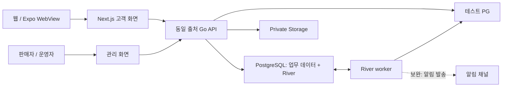

# 실제 서비스 기준 아키텍처·사용자 흐름 비교

검토일: 2026-09-27. `main` HEAD `0cb22f9`와 현재 미커밋·미추적 구현을 함께 읽은 정적 검토다. 비교 대상은 소규모 팀이 운영하는 서핑·테니스 중고거래와 입점사 판매 서비스이며, 특정 회사의 비공개 시스템을 비교한 것은 아니다.

SNS 로그인은 후속 범위로 유지한다. 이 문서는 운영 전환이나 기능 확장 실행 지시가 아니다. 이번 검토에서는 앱 테스트·빌드·DB 검사·원격 접속·배포를 실행하지 않았다. 코드에 구현된 것, 테스트 기록으로 확인된 것, 실제 환경에서 검증된 것을 구분한다.

## 1. 판단

현재 구조는 초기 서비스의 기반으로 유지할 만하다. Next.js/Expo WebView, Go API, PostgreSQL, River worker, 별도 migration은 각각 필요한 책임을 맡고 있다. 현 규모에서 마이크로서비스나 별도 메시지 브로커를 추가할 근거는 확인하지 못했다.

우선 보완할 대상은 사용자·판매자·운영자의 업무 흐름이다. 현재는 매물과 게시글 검토, 주문·결제 등 개별 기능이 존재하지만, 검토자 권한과 재고 준비는 fixture 의존성이 있고 판매자 주문 처리와 결제 이후 거래 완료 흐름은 연결되지 않았다.

`platform.ParseConfig`는 `APP_ENV=test`와 fixture/supabase-test만 허용한다. 따라서 지금 코드는 의도적으로 테스트 서비스이며, 이 가드를 단순 제거하는 것으로 운영 구성이 완성되지 않는다. [설정 코드](../apps/api/internal/platform/config.go)

## 2. 구조 비교

| 영역 | 현재 코드 | 실제 서비스에 맞춘 판단·보완 |
| --- | --- | --- |
| 고객 화면 | Next.js 웹을 Expo WebView가 재사용 | 유지. 외부 결제 앱 복귀·쿠키·오프라인·뒤로가기는 별도 기기 검증 필요 |
| API | 동일 출처 `/api/v1`, Go 안에 auth/listings/memberdata/orders/social 모듈 | 모듈을 나눈 단일 API로 유지. 공통 세션·오류·트랜잭션 규칙을 점진적으로 정렬 |
| 데이터 | 신규 Go 데이터는 `summergear_app`, legacy는 Supabase `public` | 전환기 공존은 가능. 기능별 데이터 소유자와 legacy 종료 조건을 명시 |
| 권한 | 세션 회원 컨텍스트를 트랜잭션에 설정, DB RLS·제약 병행 | 유지. HTTP 권한과 DB 역할이 같은 업무 권한을 표현하도록 정렬 |
| 이미지 | private Storage·서명 URL·업로드/확정·복구 모듈 | 유지. 목록의 이미지 조회 실패가 전체 응답에 미치는 영향과 지연은 측정 필요 |
| 비동기 작업 | HTTP API와 River worker 분리, 예약 만료·결제 대조 주기 작업 | 유지. 업무별 작업, 지연·실패 추적, 운영자 복구 경로 보완 |
| 검토·판매자 | 검토 화면/API는 있으나 fixture 검토자와 SQL 재고 준비에 의존 | 지속 가능한 운영자 권한과 판매자·재고 관리 경로 필요 |
| 거래 | 단일 상품·수량 1, 가격 스냅샷·예약·승인·전체 취소 | 테스트 결제 범위로는 일관됨. 판매자 처리·수령·거래 완료 상태는 별도 필요 |
| 채팅 | Go 회원 기반 저장과 3초 주기 전체 대화 조회 | 초기 폴링은 유지 가능. 증분 조회·목록 갱신·읽음 의미·알림을 먼저 보완 |
| 배포·관측 | 역할별 이미지, 제한된 권한, readiness·로그·graceful shutdown | 좋은 기반. 결제 미확정·작업 실패·복구 지연에 대한 경보와 대응 절차 필요 |
| 검증 | 단위·계약·DB fixture 경로 존재 | 로컬/CI의 실행 모듈 불일치 수정. 실제 브라우저 E2E와 외부 서비스 검증은 별도 |

권장 구조는 현재 기반을 유지하면서 사용자 화면과 운영 화면을 같은 업무 API에 연결하는 것이다.

현재 legacy Supabase 직접 접근은 위 목표 경로 밖에 일부 남아 있다. 한 번에 삭제하기보다 해당 기능의 소비자·데이터·권한을 확인한 뒤 순차 정리한다.

## 3. 사용자 흐름 비교

### 판매 등록과 검토

현재: 임시 로그인 → 매물 등록·사진 → 검토 대기 → fixture 검토자의 승인/반려 → 공개 → 별도 SQL fixture로 판매자·재고 준비 → 구매 가능.

권장: 회원의 판매 자격 확인 → 매물 등록·사진 → 검토 → 승인·반려 통지 → 승인된 판매 주체의 재고 관리 → 판매 시작 → 수정/판매 중지/거래 종료.

매물 콘텐츠 승인과 판매자 승인·재고는 서로 다른 조건이므로 분리를 유지한다. 대신 사용자가 어떤 조건이 남았는지 알 수 있고 해당 담당자가 화면 또는 관리 API로 처리할 수 있어야 한다. 테스트에서는 격리된 관리 경로로 이 흐름을 검증하면 된다.

### 구매와 결제

현재: 검색 → 상세·구매 가능 여부 확인 → 서버 가격으로 주문·15분 재고 예약 → 테스트 PG → 승인/결과 확인 중 → 주문 상세 → 전체 취소.

권장: 위 흐름 → 판매자 주문 접수 → 직접 전달 또는 발송 → 수령 확인 → 거래 완료. 문제가 생기면 미결제 취소, 전달 전 취소, 전달 후 반품 요청을 업무 상태에 맞춰 구분한다.

결제·주문·재고를 별도 상태로 관리하는 현재 방향은 유지한다. 첫 확장은 실제 배송사/정산 연동보다 테스트용 전달·수령·완료 상태와 판매자 내역으로 제한할 수 있다. 개인 직거래와 입점사 PG 구매 중 어떤 흐름을 지원할지도 상품에서 명확히 표시해야 한다.

### 채팅과 알림

현재: 상세에서 문의 → 참여자 대화방 → 메시지 저장·중복 nonce 방지 → 3초마다 전체 메시지 재조회 → 수신 시 읽음 저장.

권장: 같은 흐름에서 최근 메시지와 이후 변경만 가져오고, 화면에 실제 표시한 메시지까지 읽음 처리한다. 채팅 목록·미읽음 수 갱신과 앱을 닫았을 때의 서버 알림을 연결한다. WebSocket 도입은 트래픽·지연 목표가 폴링으로 충족되지 않을 때 판단한다.

### 커뮤니티

현재: 작성 → 모든 글 검토 대기 → 승인 후 공개 → 댓글·좋아요. 공개된 글의 수정은 차단한다.

권장: 사전 검토를 유지할지 위험 유형만 검토할지 제품 정책으로 결정한다. 운영자 권한·검토 알림·작성자 철회·신고·비공개 전환을 준비한다. 사전 검토가 잘못된 것은 아니지만 모든 글에 적용하면 담당자가 자리를 비운 동안 게시가 멈춘다는 운영 비용이 있다.

## 4. 우선 확인·개선할 사항

### A. fixture 밖의 검토·판매 준비 흐름

확인: 매물과 커뮤니티 검토 핸들러는 `IsFixtureReviewer`를 호출한다. 이 함수는 fixture 역할 활성화와 고정 reviewer 회원을 요구한다. DB에는 `listing_reviewers` 테이블이 있지만 DB 권한만 부여해서는 HTTP 검토 경로를 사용할 수 없다. 재고 준비는 `review-fixture.sql`에서 지정 판매자/매물에 수행한다.

영향: 현재 검토 UI는 일반 테스트 배포나 운영자 관리 화면으로 바로 사용할 수 없다. 승인된 매물이더라도 구매 준비가 별도로 필요하다.

제안: fixture 로그인 가드는 유지하고, 업무상 검토 권한은 서버의 역할 모델로 분리한다. 판매자 승인·재고 준비를 권한 있는 담당자가 처리하는 API/UI를 추가한다. fixture 계정 선택을 공개하는 방식으로 해결하지 않는다.

근거: [검토 핸들러](../apps/api/internal/listings/review_http.go), [검토자 설정](../apps/api/internal/auth/config.go), [커뮤니티 권한](../apps/api/internal/social/http.go), [재고 fixture](../ops/nhn-rocky/db/review-fixture.sql).

### B. 결제 완료와 거래 완료의 의미

확인: 결제 승인 시 주문은 `confirmed`가 된다. 프로필의 `transactionCount`는 구매자의 `confirmed` 주문을 세며 화면은 이를 완료 거래로 표시한다. 주문 목록 API는 `ListBuyerOrders`를 사용한다. 판매자 주문 접수·인도·수령·거래 완료 경로는 확인한 라우터에 없다.

영향: 테스트 결제 완료는 확인할 수 있지만 실제 물품 거래가 끝났는지는 표현할 수 없다. 판매자는 자기 매물 목록과 판매 주문 관리가 분리돼 있지 않다.

제안: 현재 지표는 결제 완료 건수로 정확히 표시하거나, 거래 완료 상태를 추가한 뒤 해당 상태를 집계한다. 판매자 주문 목록과 허용된 상태 전이부터 구현하고, 환불 가능 조건도 그 상태와 함께 정한다.

근거: [결제 반영](../apps/api/internal/orders/store_extra.go), [프로필 집계](../apps/api/internal/memberdata/store.go), [주문 API](../apps/api/internal/orders/http.go), [구매자 주문 조회](../apps/api/internal/orders/store.go).

### C. 미확정 결제의 운영 복구

확인: 결제 시도/취소 의도를 먼저 저장하고 외부 PG를 호출한다. 불명확한 응답은 성공으로 만들지 않고 worker가 PG를 재조회한다. 다만 미확정 결과가 오래 유지될 때 담당자가 확인·조치하는 업무 경로는 확인하지 못했다. 웹훅 이벤트는 재시도 10회 미만만 대상이며, 결제 대조는 승인된 과거 주문까지 50개씩 순환 조회한다.

영향: 자동 대조로 해결되는 장애에는 대응하지만 계속 확인할 수 없는 결제의 담당자·기한·조치가 부족하다. 거래 누적에 따른 대조 지연과 PG 조회량은 측정이 필요하다. 데이터 유실이 확인됐다는 뜻은 아니다.

제안: 미확정 주문·실패 이벤트 목록, 확인 시각·횟수·다음 실행 시각, 안전한 재대조와 감사 이력을 제공한다. 미완료 결제 우선 처리와 완료 결제의 저빈도 대조를 구분한다. 후속 작업을 추가할 때 업무 변경과 River 작업을 같은 트랜잭션에 기록하고 정기 대조는 보완 경로로 유지하는 방식을 검토한다. [River 공식 설명](https://riverqueue.com/docs/transactional-enqueueing)

근거: [승인·대조](../apps/api/internal/orders/store_extra.go), [전체 취소](../apps/api/internal/orders/refund.go), [주기 작업](../apps/api/internal/jobs/sample.go). 서버 승인과 결제 결과 확인을 분리하는 원칙은 [Toss 결제 흐름](https://docs.tosspayments.com/guides/v2/get-started/payment-flow)과 함께 대조했다.

### D. 채팅의 전체 조회와 읽음 처리

확인: 서버 대화 조회는 메시지 전체를 반환하고 웹은 3초마다 같은 대화를 조회한다. 채팅 목록은 진입/명시적 재시도 시 로딩하며 자동 갱신하지 않는다. 채팅방은 문서가 숨겨졌을 때 로컬 알림을 보내면서도 읽음 요청을 호출한다. 서버 읽음 처리는 특정 메시지 경계 없이 해당 방의 미읽음 메시지를 모두 갱신한다.

영향: 메시지가 쌓일수록 네트워크·DB 비용이 증가한다. 화면을 실제로 보지 않은 메시지가 읽음으로 처리될 수 있고 채팅 목록의 미읽음 수가 최신 상태를 반영하지 않을 수 있다. 이는 코드상 경로 관찰이며 이번 검토에서 브라우저로 재현하지 않았다.

제안: 커서 기반 최근 메시지/증분 조회, 화면 표시 중일 때만 마지막 표시 메시지까지 읽음 처리, 목록 갱신을 먼저 구현한다. 폴링은 비활성 화면에서 중단/완화하고 재접속 때 누락 메시지를 복구한다. 기존 `clientNonce` 중복 방지와 참여자 권한 검사는 유지한다.

근거: [채팅 저장소](../apps/api/internal/social/chat.go), [폴링 클라이언트](../apps/web/lib/chat/realtime.ts), [채팅방](../apps/web/app/chat/[id]/page.tsx), [채팅 목록](../apps/web/app/chats/page.tsx).

### E. Go 회원과 legacy 알림·데이터 경로

확인: Go 세션 기반 개인 기능은 추가됐지만 프로필/찜/목록에 legacy Supabase 경로도 있다. 푸시 토큰 등록은 여전히 Supabase 인증과 `public.push_tokens`를 사용한다. Next 프록시에도 legacy 세션 조회가 남아 있다.

영향: Go 로그인과 legacy 로그인이 자동으로 같은 사용자를 뜻하지 않는다. Go 로그인 사용자가 알림 켜기를 누르는 흐름은 별도 인증 경계에 걸린다.

제안: 현재 제공하는 각 기능에 대해 인증·조회·쓰기 소유자를 표로 관리하고, Go 회원용 기기 등록·로그아웃 해제·서버 알림 발송을 연결한다. legacy 종료는 실제 소비자 확인 뒤 단계적으로 진행한다. RLS는 DB 접속 역할에 따라 적용 범위가 달라지므로 역할별 검사를 유지한다. [PostgreSQL RLS 공식 설명](https://www.postgresql.org/docs/current/ddl-rowsecurity.html)

근거: [프로필](../apps/web/lib/profile/use-profile.ts), [찜](../apps/web/lib/listings/use-favorites.ts), [푸시 등록](../apps/web/lib/supabase/mutations.ts), [Next 프록시](../apps/web/proxy.ts).

### F. CI가 신규 DB 모듈을 실행하지 않는 차이

확인: `ops/nhn-rocky/in-toolchain.sh`의 listings-integration에는 `memberdata`와 `social`이 포함돼 있지만, CI가 사용하는 `ops/deployment/check-db.sh`의 패키지 목록에는 두 모듈이 없다. integration 태그 컴파일이나 일반 단위 검사만으로 이 모듈의 DB 통합 사례가 실행되지는 않는다.

영향: 로컬 fixture 검사가 통과해도 CI는 같은 범위의 회원·채팅·커뮤니티 DB 회귀를 보장하지 않는다.

제안: 두 실행 경로의 대상 모듈을 정렬하고 신규 모듈이 누락되지 않도록 검사 목록을 관리한다. 검사를 더 자주 돌리는 것보다 한 번 실행할 때 필요한 사례가 포함되는 것이 우선이다.

근거: [로컬 검사](../ops/nhn-rocky/in-toolchain.sh), [CI DB 검사](../ops/deployment/check-db.sh), [CI Compose](../ops/deployment/compose.ci.yml), [CI workflow](../.github/workflows/keyless-ci.yml).

## 5. 유지할 설계와 후속 순서

유지할 설계는 서버 가격 스냅샷·재고 잠금, 세션 회원 기반 권한, private 이미지, API/worker/migration 역할 분리, PG 결과 재조회, 메시지 중복 방지, 매물 검색 커서다. 외부 검색 엔진·WebSocket·마이크로서비스는 사용량과 응답 지연 근거가 생긴 뒤 검토한다. 최신 200개 구매 가능한 후보에서 점수를 계산하는 현재 추천은 테스트 규모에 적합하지만 전체 카탈로그 추천이라는 의미는 아니다.

권장 순서:

1. 기존 3~6단계의 Linux/DB·브라우저 검증을 마무리하고 CI 대상 차이를 수정한다. 유효한 기존 결과는 재사용한다.
2. 테스트 서비스 안에서 운영자 권한·판매자 재고 준비·판매자 주문 목록을 연결한다.
3. 개인 직거래/PG 거래 정책을 정하고 인도·수령·완료 및 취소 가능 상태를 연결한다.
4. 채팅 증분 조회·읽음·목록 갱신, Go 회원 알림을 구현한다.
5. 미확정 결제·실패 작업을 담당자가 처리하는 화면, 지연/실패 경보, 백업 복구 연습을 준비한다.

실제 운영 전환은 SNS 로그인만 추가한다고 끝나지 않는다. 환경별 권한·비밀 설정·외부 PG/Storage·모바일 복귀·복구 절차를 별도 확인해야 한다. 테스트용인 현재 프로젝트에서는 운영 가드를 유지하면서 위 업무 흐름을 테스트 데이터로 완성하는 것이 우선이다.

## 6. 이번 검토의 한계

- 코드·migration·계약·검증 스크립트·기존 검증 기록을 읽었다. 새로 앱 테스트나 E2E를 실행하지 않았다.
- 실제 배포 환경의 인프라 경보·접근 제어·백업 상태는 확인하지 않았다. 저장소에서 확인하지 못한 항목을 외부에도 없다고 단정하지 않는다.
- 성능 관련 지적은 쿼리와 호출 구조에 근거한 예상이며 측정 결과가 아니다.
- 기능 구현·검증 완료율을 수치로 매기지 않는다. 정적 확인은 실제 사용자 흐름의 통과를 대신하지 않는다.
- 이번 변경은 이 비교 문서와 문서 목차뿐이다. 앱 코드·계약·migration·환경변수는 수정하지 않았고 브랜치·커밋·push·배포를 수행하지 않았다.
